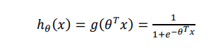
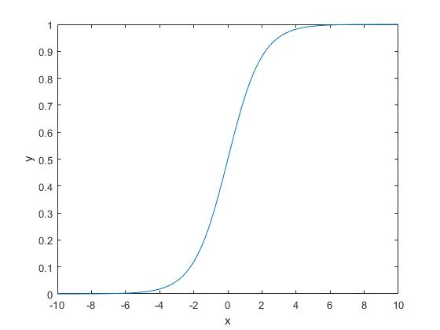
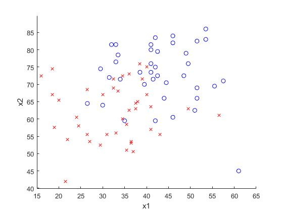
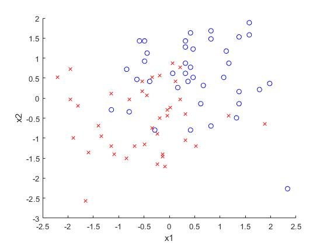
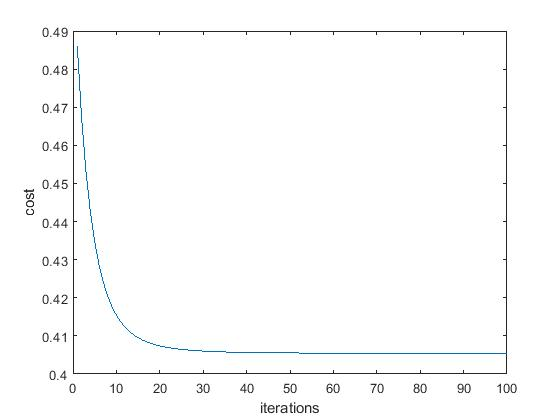
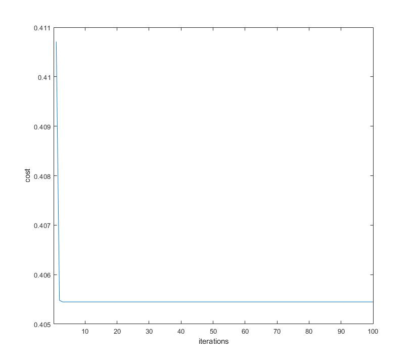

## Part 2

#### Task 1:

According to :
# 
the code change to

``` Matlab
output = 1./(1+exp(-z));  
```

The figure shows：
# 

#### Task 2：

Plot the data:
# 
Normalized the data：
# 

The new figure shows that the

#### Task 3：

``` Matlab
function result=calculate_hypothesis(X,theta,training_example)
    hypothesis = 0.0;
    [y , x] = size(theta);
    for i =1 : x
        hypothesis = hypothesis + X(training_example, i)* theta(i);
    end
    result=sigmoid(hypothesis);
end

```
#### Task 4：
The Final cost found is 0.40545
the cost graph:
# 

#### Task 5：

Modify the code
``` Matlab
y1 = min_x1*(-theta(1)/theta(2));
y2 = max_x1*(-theta(1)/theta(2));
plot([min_x1,max_x1],[y1,y2],'-')
```
Graph:
# 


#### Task 6：

- First time
 - Training error:0.32608
 - Test error:0.66556

- Second time
 - Training error:0.48779
 - Test error:0.29797

- Third Time
 - Training error:0.46722
 - Test error:0.32186


#### Task 7：

Modify the code

``` Matlab
% for question 7, modify the dataset X to have more features (in each row)
    % append to X(i),the following features:
    % here append x_2 * x_3 (remember that x_1 is the bias)
    X_2byX_3 = X(:, 2) .* X(:, 3);
    % here append x_2 * x_2 (remember that x_1 is the bias)
    X_2byX_2 = X(:, 2) .* X(:, 2);
    % here append x_3 * x_3 (remember that x_1 is the bias)
    X_3byX_3 = X(:, 3) .* X(:, 3);

    X = [X, X_2byX_3, X_2byX_2, X_3byX_3];
% initialise theta
alpha = 0.05;
iterations = 100;
```
Error:0.39537
