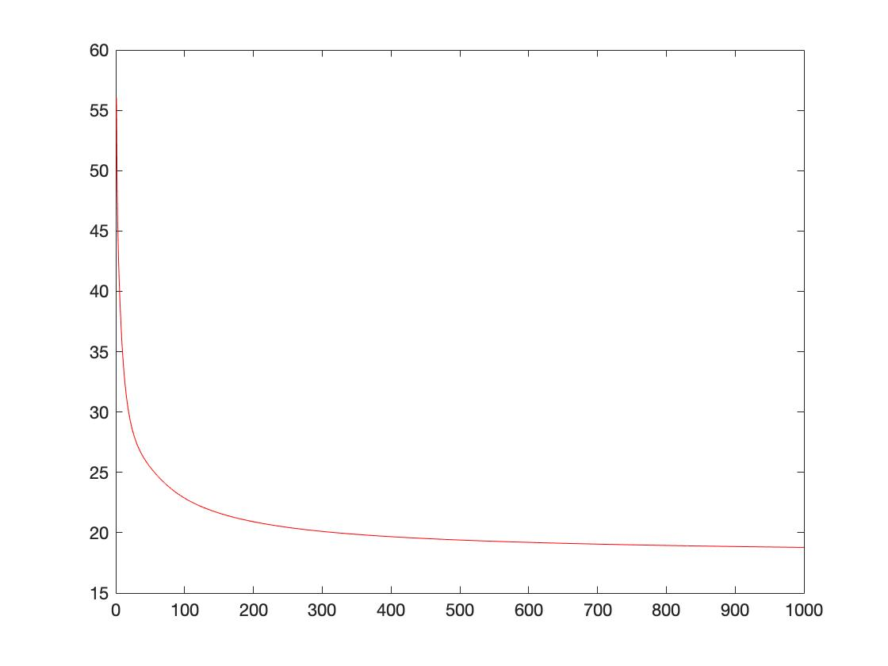
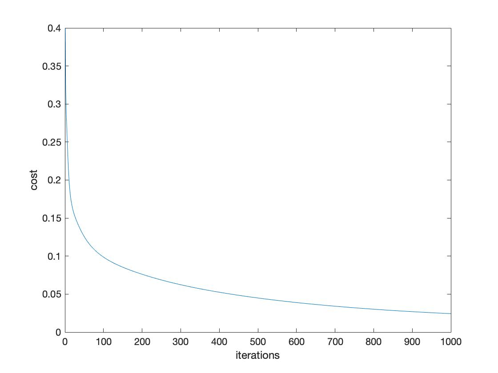

## Part 2

### Logistic Regression

#### Task 1:

According to :
# 
the code change to

``` Matlab
output = 1./(1+exp(-z));  
```

The figure shows：
# 

#### Task 2：

Plot the data:
# 
Normalized the data：
# 

The new figure shows that the

#### Task 3：

``` Matlab
function result=calculate_hypothesis(X,theta,training_example)
    hypothesis = 0.0;
    [y , x] = size(theta);
    for i =1 : x
        hypothesis = hypothesis + X(training_example, i)* theta(i);
    end
    result=sigmoid(hypothesis);
end

```
#### Task 4：
The Final cost found is 0.40545
the cost graph:
# 

#### Task 5：

Modify the code
``` Matlab
y1 = min_x1*(-theta(1)/theta(2));
y2 = max_x1*(-theta(1)/theta(2));
plot([min_x1,max_x1],[y1,y2],'-')
```
Graph:
# 


#### Task 6：

1. First time
 - Training error:0.32608
 - Test error:0.66556

2. Second time
 - Training error:0.48779
 - Test error:0.29797

3. Third Time
 - Training error:0.46722
 - Test error:0.32186


#### Task 7：

Modify the code

``` Matlab
% for question 7, modify the dataset X to have more features (in each row)
    % append to X(i),the following features:
    % here append x_2 * x_3 (remember that x_1 is the bias)
    X_2byX_3 = X(:, 2) .* X(:, 3);
    % here append x_2 * x_2 (remember that x_1 is the bias)
    X_2byX_2 = X(:, 2) .* X(:, 2);
    % here append x_3 * x_3 (remember that x_1 is the bias)
    X_3byX_3 = X(:, 3) .* X(:, 3);

    X = [X, X_2byX_3, X_2byX_2, X_3byX_3];
% initialise theta
alpha = 0.05;
iterations = 100;
```
Error:0.39537

# 

#### Task 8：

Train set is set to 70 (overfitting):
# 
 - Training cost :0.12649
 - Test cost :0.67195

Train set is set to 10:
# 
 - Training cost :0.34411  
 - Test cost :0.43497


After added a third order x1*x1*x1, and the weight is 1.0

``` Matlab
%third order
X_2byX_2byX_2 = X(:, 2) .* X(:, 2).*X(:, 2);

X = [X, X_2byX_3, X_2byX_2, X_3byX_3,X_2byX_2byX_2];
% initialise theta. Remember that theta needs to be
% the same size as one row of X
theta=[1.0,1.0,1.0,1.0,1.0,1.0,1.0];
```

The train set is set to 40:
 - Graph 1:
# 
 - Graph 2:
# 
 - Training:0.1405
 - Test:0.65299

The second graph shows that the red line (test set) goes up. However, the blue line (training set) goes down. The third order polynomial caused the function overfitting.


#### Task 9：
The data points for an xor function are not linearly seperable.


### Neural Network

#### Task 10:
Implement backpropagation:
###### Step 1:
``` Matlab
% Step 1. Output deltas (used to change weights from hidden --> output)
output_deltas = zeros(1,length(nn.output_neurons));
outputs=nn.output_neurons;
for i=1:length(outputs)
      output_deltas(i) = (outputs(i)-targets(i))*sigmoid_derivative(outputs(i));
end
```

###### Step 2:
``` Matlab
% Step 2. Hidden deltas (used to change weights from input --> output).
hidden_deltas = zeros(1,length(nn.hidden_neurons));

for j=1:length(nn.hidden_neurons)

    accumulate = 0;
    for i=1:length(outputs)
          accumulate = accumulate + output_deltas(i) * nn.output_weights(j,i);
    end
    hidden_deltas(j) = accumulate * sigmoid_derivative(nn.hidden_neurons(1,j));
end
```

###### Step 3:
``` Matlab
% Step 3. update weights output --> hidden
for i=1:length(nn.hidden_neurons)
    for j=1:length(output_deltas)
        nn.output_weights(i,j) =nn.output_weights(i,j) -(output_deltas(j) * nn.hidden_neurons(i) * learning_rate);
    end
end
```

###### Step 4:
``` Matlab
% Step 4. update weights input --> hidden.
for i=1:length(nn.hidden_neurons)
    for j=1:length(hidden_deltas)
        nn.hidden_weights(i,j) =nn.hidden_weights(i,j) -(hidden_deltas(j) * nn.hidden_neurons(i) * learning_rate);
    end
end
```
#### Task 11:


#### Task 12:

###### When hidden neurons equals to 1:
Cost graph:
# 
Differences between training and test sets:
# 

###### When hidden neurons equals to 2:
Cost graph:
# 
Differences between training and test sets:
# 

###### When hidden neurons equals to 3:
Cost graph:
# 
Differences between training and test sets:
# 
