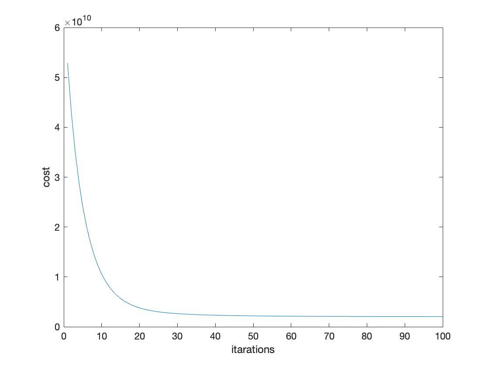
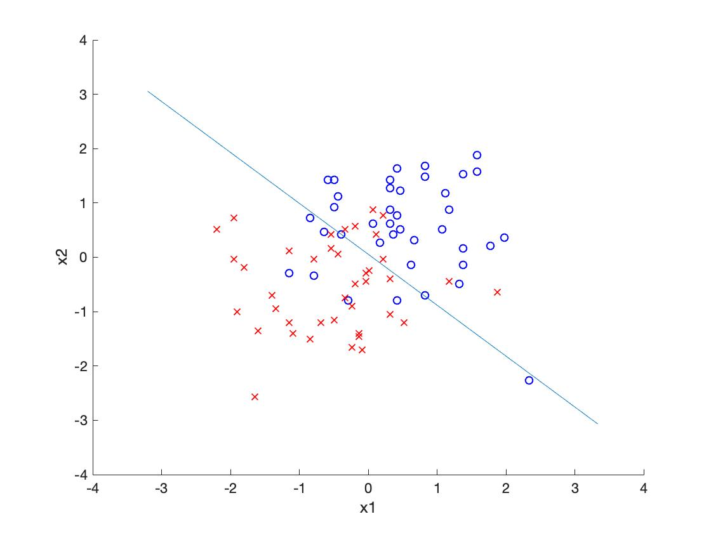
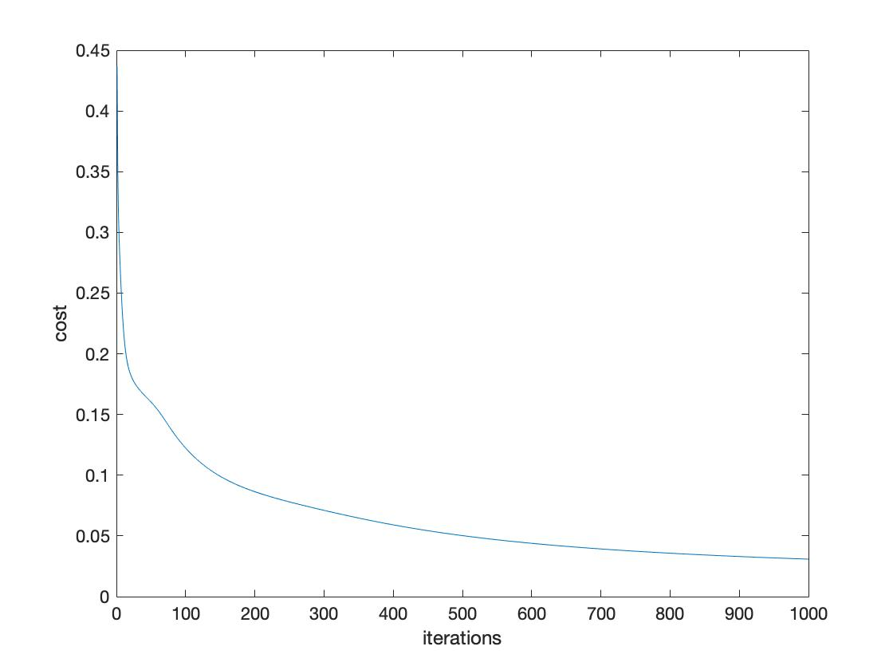
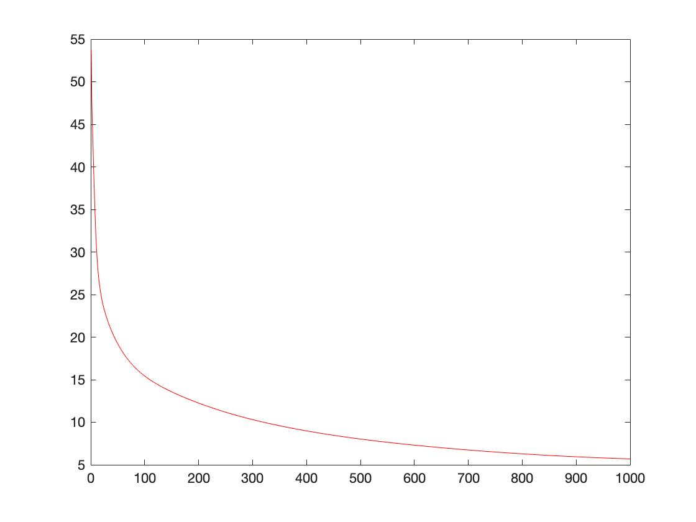

## Part 1
#### Task 1
##### 1.1:
According to
# 

Modify the [calculate_hypothesis.m](https://github.com/DaBaiHao/Machine-Learning/blob/master/Assignment1-2017/part1/linear-regression1/calculate_hypothesis.m):
``` Matlab
theta_0 = theta(1);
theta_1 = theta(2);
hypothesis =X(training_example,1) * theta_0 + theta_1 * X(training_example, 2);

```
##### 1.2:
Modify the [gradient_descent.m](https://github.com/DaBaiHao/Machine-Learning/blob/master/Assignment1-2017/part1/linear-regression1/gradient_descent.m)
``` Matlab
% hypothesis = X(i, 1) * theta(1) + X(i, 2) * theta(2);
hypothesis = calculate_hypothesis(X,theta,i);
```
##### 1.3:

When the learning rate equals to 0.1:
# 

When the learning rate equals to 0.01:
# 

When the learning rate equals to 0.001:
# 

Observations:
Low learning rates caused slow convergence and needed more iterations. However, the cost graph shows that it is more likely to got the local optimum than high learning rates.


#### Task 2:

##### 2.1:

According to
# 

Modify the [calculate_hypothesis.m](https://github.com/DaBaiHao/Machine-Learning/blob/master/Assignment1-2017/part1/linear-regression2/calculate_hypothesis.m):

``` Matlab
function hypothesis = calculate_hypothesis(X, theta, training_example)
    %CALCULATE_HYPOTHESIS This calculates the hypothesis for a given X,
    %theta and specified training example

    theta_0 = theta(1);
    theta_1 = theta(2);
    theta_2 = theta(3);


    hypothesis =1 * theta_0 + theta_1 * X(training_example, 2) + theta_2 * X(training_example, 3);


    %hypothesis = 0.0;
end

```
Modify the [gradient_descent.m](https://github.com/DaBaiHao/Machine-Learning/blob/master/Assignment1-2017/part1/linear-regression2/gradient_descent.m), Add:

``` Matlab
for i = 1:m
    %hypothesis = X(i, 1) * theta(1) + X(i, 2) * theta(2);
    %hypothesis = 1 * theta(1) + X(i, 2) * theta(2) + X(i, 3) * theta(3);
    hypothesis = calculate_hypothesis(X,theta,i);
    output = y(i);
    sigma = sigma + (hypothesis - output) * X(i, 3);
end

theta_2 = theta_2 - ((alpha * 1.0) / m) * sigma;


%update theta
theta = [theta_0, theta_1, theta_2];
```

##### 2.2:

When alpha equals 0.1:
# 
The theta
 - 1.0e+05 * 3.4040    
 - 1.0e+05 * 1.0708   
 - 1.0e+05 * -0.0223

When alpha equals 0.5:
# 
The theta
 - 1.0e+05 * 3.4041    
 - 1.0e+05 * 1.1063   
 - 1.0e+05 * -0.0665

When alpha equals 0.05:
# 
The theta
 - 1.0e+05 * 3.3840    
 - 1.0e+05 * 0.9433   
 - 1.0e+05 * 0.1360

Observations:
The alpha have strong effect on the theta value finding. At the end of the optimization, When the alpha equals to 0.5, the best theta value is :
- 1.0e+05 * 3.4041    
- 1.0e+05 * 1.1063   
- 1.0e+05 * -0.0665

##### 2.3:
According to :
# 
the code modified to:

``` Matlab
Xpredict = [3000,4];
Xnorm = (Xpredict - mean_vec)./std_vec;
Xnorm = [1,Xnorm];
Ypredict = sum(Xnorm .* theta);
disp(Ypredict);
```

 - When 1650 sq.ft. 3 bedrooms:
   The predicts price is
> 2.9308e+05

- When 3000 sq.ft. 4 bedrooms:
  The predicts price is
> 4.7228e+05


#### Task 3:
##### 3.1

Modify the [gradient_descent.m](https://github.com/DaBaiHao/Machine-Learning/blob/master/Assignment1-2017/part1/linear-regression3/gradient_descent.m),

###### Add lamda :
``` Matlab
function theta = gradient_descent(X, y, theta, alpha, iterations,l, do_plot)

...
cost_vector = [cost_vector; compute_cost_regularised(X, y, theta,l)];
...

end
```

###### Update theta 0 :
``` Matlab
sigma = 0.0;

for i = 1:m
    %hypothesis = 1 * theta(1) + X(i, 1) * theta(2) + X(i, 2) * theta(3);
    hypothesis = calculate_hypothesis(X,theta,i);
    output = y(i);
    sigma = sigma + (hypothesis - output)*X(i, 1);
end

theta(1) = theta(1) - ((alpha * 1.0) / m) * sigma;

```

###### Update theta 1 and other theta :
``` Matlab
sigma = 0.0;

for i = 1:m
    %hypothesis = X(i, 1) * theta(1) + X(i, 2) * theta(2);
    %hypothesis = 1 * theta(1) + X(i, 1) * theta(2) + X(i, 2) * theta(3);
    hypothesis = calculate_hypothesis(X,theta,i);
    output = y(i);
    sigma = sigma + (hypothesis - output) * X(i, 2);
end

theta(2) = theta(2)*(1 - alpha*l/m) - ((alpha * 1.0) / m) * sigma;

```


Modify the [calculate_hypothesis.m](https://github.com/DaBaiHao/Machine-Learning/blob/master/Assignment1-2017/part1/linear-regression3/calculate_hypothesis.m):
``` Matlab
function hypothesis = calculate_hypothesis(X, theta, training_example)
    %CALCULATE_HYPOTHESIS This calculates the hypothesis for a given X,

    hypothesis =(X(training_example, 1)) * theta(1) + theta(2) * (X(training_example, 2))^1 + theta(3) * (X(training_example, 3))^2+ theta(4) * (X(training_example, 4))^3+ theta(5) * (X(training_example, 5))^4+ theta(6) * (X(training_example, 6)^5);

end

```
##### 3.2
###### Changing alpha
###### When alpha equals 0.1, lamda 0.1

The cost graph:
# 
Curve:
# 


###### When alpha equals 0.2, lamda 0.1

The cost graph:
# 
Curve:
# 

###### When alpha equals 0.9, lamda 0.1

The cost graph:
# 
Curve:
# 


###### When alpha equals 0.001, lamda 0.1

The cost graph:
# 
Curve:
# 

##### When alpha equals 0.9, is the best value of alpha.

##### 3.3
###### Changing lamda
###### lamda equals 0.1, alpha 0.9
The cost graph:
# 
Curve:
# 

###### lamda equals 1, alpha 0.9
The cost graph:
# 
Curve:
# 

###### lamda equals 100, alpha 0.9
The cost graph:
# 
Curve:
# 

The lamda is the a kind of penalty function, to prevent the overfitting. The large number lamda will highly affect the curve to fit the dataset.


----
## Part 2

### Logistic Regression

#### Task 1:

According to :
# 
the code modified to

``` Matlab
output = 1./(1+exp(-z));  
```

The figure shows：
# 

#### Task 2：

Plot the data:
# 
Normalized the data：
# 

The new figure shows that the

#### Task 3：

``` Matlab
function result=calculate_hypothesis(X,theta,training_example)
    hypothesis = 0.0;
    [y , x] = size(theta);
    for i =1 : x
        hypothesis = hypothesis + X(training_example, i)* theta(i);
    end
    result=sigmoid(hypothesis);
end

```
#### Task 4：
The Final cost found is 0.40545
the cost graph:
# 

#### Task 5：

Modify the code
``` Matlab
y1 = min_x1*(-theta(1)/theta(2));
y2 = max_x1*(-theta(1)/theta(2));
plot([min_x1,max_x1],[y1,y2],'-')
```
Graph:
# 


#### Task 6：

1. First time
 - Training error:0.32608
 - Test error:0.66556

2. Second time
 - Training error:0.48779
 - Test error:0.29797

3. Third Time
 - Training error:0.46722
 - Test error:0.32186


#### Task 7：

Modify the code

``` Matlab
% for question 7, modify the dataset X to have more features (in each row)
    % append to X(i),the following features:
    % here append x_2 * x_3 (remember that x_1 is the bias)
    X_2byX_3 = X(:, 2) .* X(:, 3);
    % here append x_2 * x_2 (remember that x_1 is the bias)
    X_2byX_2 = X(:, 2) .* X(:, 2);
    % here append x_3 * x_3 (remember that x_1 is the bias)
    X_3byX_3 = X(:, 3) .* X(:, 3);

    X = [X, X_2byX_3, X_2byX_2, X_3byX_3];
% initialise theta
alpha = 0.05;
iterations = 100;
```
Error:0.39537

# 

#### Task 8：

Train set is set to 70 (overfitting):
# 
 - Training cost :0.12649
 - Test cost :0.67195

Train set is set to 10:
# 
 - Training cost :0.34411  
 - Test cost :0.43497


After added a third order x1*x1*x1, and the weight is 1.0

``` Matlab
%third order
X_2byX_2byX_2 = X(:, 2) .* X(:, 2).*X(:, 2);

X = [X, X_2byX_3, X_2byX_2, X_3byX_3,X_2byX_2byX_2];
% initialise theta. Remember that theta needs to be
% the same size as one row of X
theta=[1.0,1.0,1.0,1.0,1.0,1.0,1.0];
```

The train set is set to 40:
 - Graph 1:
# 
 - Graph 2:
# 
 - Training:0.1405
 - Test:0.65299

The second graph shows that the red line (test set) goes up. However, the blue line (training set) goes down. The third order polynomial caused the function overfitting.


#### Task 9：
The data points for an xor function are not linearly seperable.


### Neural Network

#### Task 10:
Implement backpropagation:
###### Step 1:
``` Matlab
% Step 1. Output deltas (used to change weights from hidden --> output)
output_deltas = zeros(1,length(nn.output_neurons));
outputs=nn.output_neurons;
for i=1:length(outputs)
      output_deltas(i) = (outputs(i)-targets(i))*sigmoid_derivative(outputs(i));
end
```

###### Step 2:
``` Matlab
% Step 2. Hidden deltas (used to change weights from input --> output).
hidden_deltas = zeros(1,length(nn.hidden_neurons));

for j=1:length(nn.hidden_neurons)

    accumulate = 0;
    for i=1:length(outputs)
          accumulate = accumulate + output_deltas(i) * nn.output_weights(j,i);
    end
    hidden_deltas(j) = accumulate * sigmoid_derivative(nn.hidden_neurons(1,j));
end
```

###### Step 3:
``` Matlab
% Step 3. update weights output --> hidden
for i=1:length(nn.hidden_neurons)
    for j=1:length(output_deltas)
        nn.output_weights(i,j) =nn.output_weights(i,j) -(output_deltas(j) * nn.hidden_neurons(i) * learning_rate);
    end
end
```

###### Step 4:
``` Matlab
% Step 4. update weights input --> hidden.
for i=1:length(nn.hidden_neurons)
    for j=1:length(hidden_deltas)
        nn.hidden_weights(i,j) =nn.hidden_weights(i,j) -(hidden_deltas(j) * nn.hidden_neurons(i) * learning_rate);
    end
end
```

When learning rate equals to 2
The output :
 - target output:0, actual output0.013118
 - target output:1, actual output0.98976
 - target output:1, actual output0.46662
 - target output:0, actual output0.46685
# 

#### Task 11:

#### Task 12:


#### Task 13:

###### When hidden neurons equals to 1:
Costs of the training set:
# 
Costs of the test set:
# 
 - Error training:17.9567
 - Error testing:18.7816

###### When hidden neurons equals to 2:
Costs of the training set:
# 
Costs of the test set:
# 
 - Error training:4.909
 - Error testing:5.9335


###### When hidden neurons equals to 3:
Costs of the training set:
# 
Costs of the test set:
# 
 - Error training:3.9066
 - Error testing:5.6948

###### When hidden neurons equals to 5:
Costs of the training set:
# 
Costs of the test set:
# 
 - Error training:2.4614
 - Error testing:4.6142

###### When hidden neurons equals to 7:
Costs of the training set:
# 
Costs of the test set:
# 
 - Error training:1.0397
 - Error testing:4.4482

###### When hidden neurons equals to 10:
Costs of the training set:
# 
Costs of the test set:
# 
 - Error training:1.0285
 - Error testing:4.0931

As the number of the hidden neurons goes up, the training error and testing error decrease.
