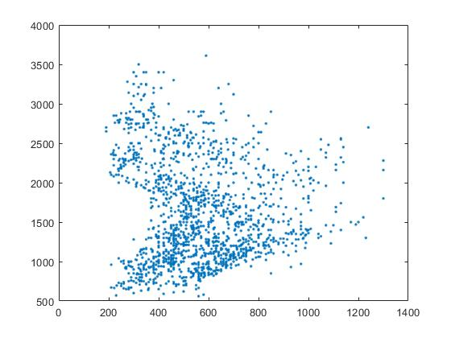
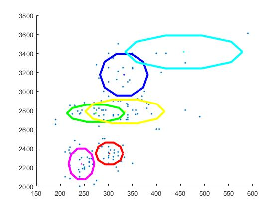
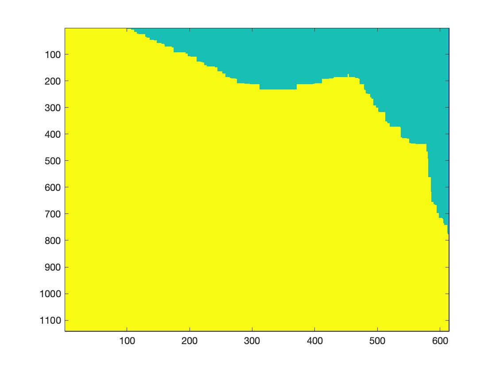
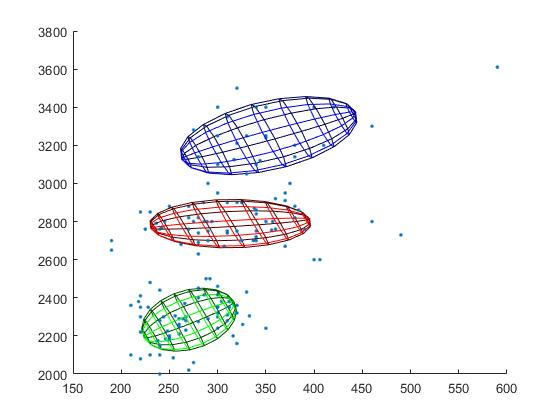

# Assignment 2: Clustering and MoG

--------------------------------------------------------------------------------

## 2\. MoG Modelling using the EM Algorithm

### Task 1:

Task 1 function:

```matlab
%% task 1
load('PB_data.mat');
J = [f1,f2];

[n,~] = size(J);

figure(1);
plot(J(:,1),J(:,2),'.');
```

The result figures:



### Task 2:

In the _mog.m_ file, adding the code below to generate a dataset **x** that contains only the F1 and F2. If the x equals to x1 is the phno1. If x equals to x2 is phno2.

```matlab
%% task 2
[number,~] = size(phno);

count_phno1 = 1;
count_phno2 = 1;
for i = 1:number
    if phno(i) == 1
        x1(count_phno1,:) = [f1(i),f2(i)];
        count_phno1 =count_phno1 + 1;
    end

    if phno(i) == 2
        x2(count_phno2,:) = [f1(i),f2(i)];
        count_phno2 =count_phno2 + 1;
    end
end

x = x1;
```

After running the _mog.m_ file, the results show below:

_1\. When K = 3, phno1:_

The result graph:

 

The result MoG model:

- _mu_ is a 2*3 matrix, the value is:

  ```matlab
  mu = [312.710439163323,    270.394427119210,    350.944427310065;
  2784.44469003590e+03,    2285.45797383453e+03,    3229.23625856582e+03]

  ```

- _p_ is a 1*3 matrix, the value is:

  ```matlab
  p = [0.382687297465680,    0.435128587673123,    0.182184114861197]
  ```

- _s2_ is a 2 _2_ 3 matrix, the value is:

``` matlab
val(:,:,1) =

  1.0e+03 *

  3.5603 0
    0    7.7339


val(:,:,2) =

1.0e+04 *


0.1214         0
     0    1.4277


val(:,:,3) =

1.0e+04 *


0.4118         0
     0    2.7091


```


*2\. When K = 6, phno1:*

The result graph:


The result MoG model:
 - *mu* is a 2*6 matrix, the value is:

```matlab
mu = [333.301151546791,    309.171182344323,    314.443682651265,    284.247267200079,    244.957501372368,    458.465969387509;
3172.63228243276e+03,    2325.24372449017e+03,    2781.85307474120e+03,    2591.94227735183e+03,    2237.62777390853e+03,    3416.81380642650e+03]
```

* *p* is a 1*6 matrix, the value is:

```matlab
p = [0.171249509264198,    0.150221313489049,    0.335031245076133,    0.0695248642416978,    0.248124309467916,    0.0258487584610062];
```

 - _s2_ is a 2 _2_ 6 matrix, the value is:

``` matlab

val(:,:,1) =

1.0e+04 *


0.1242         0
     0    2.7331


val(:,:,2) =

1.0e+03 *


0.2779         0
     0    5.7640


val(:,:,3) =

1.0e+03 *


3.9580         0
     0    6.8954


val(:,:,4) =

1.0e+04 *


0.0024         0
     0    3.1738


val(:,:,5) =

1.0e+04 *


0.0366         0
     0    1.3749


val(:,:,6) =

1.0e+04 *


0.7479         0
     0    1.6615

```


*3\. K = 6 for 2nd phoneme:*

The result graph:


The result MoG model:
- *mu* is a 2*6 matrix, the value is:

```matlab
 mu = [544.064488976845,    389.075845110550,    465.645081333001,    442.297841772107,    370.132231710788,    407.965321650608;
2883.05491920153e+03,    2212.18739345475e+03,    2582.76483436577e+03,    2347.55469226313e+03,    2004.86418512093e+03,    1954.39100593128e+03]
```


- _p_ is a 1*6 matrix, the value is:

```matlab
 p = [0.103584787611484,    0.0440218618511802,    0.307746216705428,    0.141480231793390,    0.149136837118164,    0.254030064920354]
```


- _s2_ is a 2 _2_ 6 matrix, the value is:


 ``` matlab
val(:,:,1) =

1.0e+04 *


0.7294         0
     0    3.0936


val(:,:,2) =

1.0e+03 *


1.2787         0
     0    0.3088


val(:,:,3) =

1.0e+03 *


4.3575         0
     0    7.1193


val(:,:,4) =

1.0e+03 *


1.0575         0
     0    3.8370


val(:,:,5) =

1.0e+03 *


4.6796         0
     0    3.8552


val(:,:,6) =

1.0e+04 *


0.0731         0
     0    1.4630
 ```


##  Task 3

The algorithm that to calculate the miss-classification error for each of the model:

1. Create data phno1 and phno2 .
2. Then using **mog_function(3,x1)** and **mog_function(3,x2)**, to calculate two **model** for phno1 and phno2.
3. The **mog_function** is the function to train the data for phno1 and phno2 with  MoGs and finally generate a MoG  model for  phno1 and phno2, the model included the mean of the data, covariance of the data, data category distribution probability, the algorithm is save as the mog script.
4. Then using **classfily** function to calculate the Maximum Likelihood of model for phno1 and phno2.
     The **classfily** function is that to calculate each models Maximum Likelihood using the model calculate from mog_function function.

| - |phno1 | phno2 |
| --- |--- | --- |
| model1 |z_model1(:,1) | z_model1(:,2) |
| model2  |  z_model2(:,1)| z_model2(:,2)  |

4. Compare each value, the model1 and model2 on phno1 Maximum Likelihood, if the model1 Maximum Likelihood at that point is large than another model2 Maximum Likelihood calculated that means the value predict as phno1. If the model2 Maximum Likelihood at that point is large than another model1 Maximum Likelihood calculated that means the value predict as phno2.
5. Calculate model1 miss-classification error from the number of the model 1 predict phno1 divide by the total number of phno1.  calculate model2 miss-classification error from the number of the model 2 predict phno2 divide by the total number of phno2.


**main file**
``` matlab
[number,~] = size(phno);
% Create data phno1 and phno2 .
count_phno1 = 1;
count_phno2 = 1;
for i = 1:number
    if phno(i) == 1
        x1(count_phno1,:) = [f1(i),f2(i)];
        count_phno1 =count_phno1 + 1;
    end

    if phno(i) == 2
        x2(count_phno2,:) = [f1(i),f2(i)];
        count_phno2 =count_phno2 + 1;
    end
end
% Then using mog_function(3,x1) and mog_function(3,x2), to calculate two model for phno1 and phno2.
[n,~] = size(x2);
[mu_1,p_1,s2_1] = mog_function(3,x1)
[mu_2,p_2,s2_2] = mog_function(3,x2)
z_model1 = classfily(mu_1,s2_1,p_1,x1,x2,3);
z_model2 = classfily(mu_2,s2_2,p_2,x1,x2,3);
count_phno1_model1 = 1;
count_phno2_model1 = 1;
for i = 1:n
    if z_model1(i,1) > z_model2(i,1)
        model(i,1) = 1;
        count_phno1_model1 = count_phno1_model1+1;
    else
        model(i,1) = 2;

    end

    if z_model1(i,2) > z_model2(i,2)
        model(i,2) = 1;
        count_phno2_model1 = count_phno2_model1+1;
    else
        model(i,2) = 2;
    end

end

model1_phno1_acc = count_phno1_model1/n;
model1_phno2_acc = count_phno2_model1/n;
```


**mog_function**

```matlab
function[mu,p,s2] = mog_function(k,x)
% Simple script to do EM for a mixture of Gaussians.
% -------------------------------------------------
%  based on code from  Rasmussen and Ghahramani
% (http://www.gatsby.ucl.ac.uk/~zoubin/course02/)

% Initialise parameters


[n, D] = size(x);                    % number of observations (n) and dimension (D)

p = ones(1,k)/k;                    % mixing proportions
mu = x(ceil(n.*rand(1,k)),:)';      % means picked rqandomly from data
s2 = zeros(D,D,k);                  % covariance matrices
niter=100;                          % number of iterations

% initialize covariances

for i=1:k
  s2(:,:,i) = cov(x)./k;      % initially set to fraction of data covariance
end

set(gcf,'Renderer','zbuffer');

clear Z;
try

  % run EM for niter iterations

  for t=1:niter,
    fprintf('t=%d\r',t);
    % Do the E-step:

    for i=1:k
      Z(:,i) = p(i)*det(s2(:,:,i))^(-0.5)*exp(-0.5*sum((x'-repmat(mu(:,i),1,n))'*inv(s2(:,:,i)).*(x'-repmat(mu(:,i),1,n))',2));
    end
    Z = Z./repmat(sum(Z,2),1,k);

    % Do the M-step:

    for i=1:k
      mu(:,i) = (x'*Z(:,i))./sum(Z(:,i));

      % We will fit Gaussians with diagonal covariances:

      s2(:,:,i) = diag((x'-repmat(mu(:,i),1,n)).^2*Z(:,i)./sum(Z(:,i)));

      % To fit general Gaussians use the line:
      % s2(:,:,i) =
      % (x'-repmat(mu(:,i),1,n))*(repmat(Z(:,i),1,D).*(x'-repmat(mu(:,i),1,n))')./sum(Z(:,i));

      p(i) = mean(Z(:,i));
    end

    clf
    hold on
    plot(x(:,1),x(:,2),'.');
    for i=1:k
      plot_gaussian(2*s2(:,:,i),mu(:,i),i,11);
    end
    drawnow;
  end

catch
  disp('Numerical Error in Loop - Possibly Singular Matrix');
end;

end
```

**classfily function**
1. **mu, s2, p** is the parameters of the MoG learnt for each phonemes
2. z is the 𝑝(𝑥; 𝜃1) or 𝑝(𝑥; 𝜃2),


```matlab
function z= classfily(mu,s2,p,x1,x2,k)


x = x1;
[n, D] = size(x);
% mu: the mean of the data
% s2: covariance of the data
% p: data category distribution probability
% X: The data we need to test

for i=1:k
    Z(:,i) = p(i)*det(s2(:,:,i))^(-0.5)*exp(-0.5*sum((x'- ...
    repmat(mu(:,i),1,n))'*inv(s2(:,:,i)).*(x'-repmat(mu(:,i),1,n))',2));
end

for i = 1:n
    z(i,1) = sum(Z(i,:) );
end

x = x2;
for i=1:k
    Z(:,i) = p(i)*det(s2(:,:,i))^(-0.5)*exp(-0.5*sum((x'-repmat(mu(:,i),1,n))'*inv(s2(:,:,i)).*(x'-repmat(mu(:,i),1,n))',2));
end

for i = 1:n
    z(i,2) = sum(Z(i,:) );
end


end
```

#### _When K = 3_
1. When model 1 classfily phno1 the error is _0.0197_
2. When model 2 classfily phno2 the error is _0.0526_

#### _When K = 6_

1. When model 1 classfily phno1 the error is _0.0329_
2. When model 2 classfily phno2 the error is _0.03947_


## Task 4

The algorithm that to create a classification matrix is that:

1. Find the min and max value of the f1 on phno1 and phno2
2. Find the min and max value of the f2 on phno1 and phno2
3. Find the values in f1 and f2 that in the range of the min and max value.
4. Sort the values
5. Create matrix M, the size based on the length of the values
6.  Find each point of M, which number of the [x_1(i,:),x_2(j,:)];
7. Using
``` matlab
Z(:,i) = p(i)*det(s2(:,:,i))^(-0.5)*exp(-0.5*sum((x'-repmat(mu(:,i),1,1))'*inv(s2(:,:,i)).*(x'-repmat(mu(:,i),1,1))',2));
```
using model1 and model1 that calculated pervious task 3 to calculate which point belongs to phno1 or phno2
9. Show the matrix using imagesc

main function


``` matlab
%% task4
[n,~] = size(x2);
M = zeros(number);
k = 3;
imagesc(M);

min_f1 = min([x1(:,1);x2(:,1)]);
max_f1 = max([x1(:,1);x2(:,1)]);
min_f2 = min([x1(:,2);x2(:,2)]);
max_f2 = max([x1(:,2);x2(:,2)]);

count = 1;
count_2 = 1;
for i = 1 : number
    if ((f1(i,1) <= max_f1)&&(f1(i,1) >= min_f1))
        x_1(count,1) = f1(i,1) ;
        count =count+ 1;
    end
    if ((f2(i,1) <= max_f2)&&(f2(i,1) >= min_f2))
        x_2(count_2,1) = f2(i,1) ;
        count_2 =count_2+ 1;
    end

end

x_1 = sort(x_1);
x_2 = sort(x_2);
M = zeros(count,count_2);
[i_end,~] = size(x_1);
[j_end,~] = size(x_2);
for i = 1:i_end
    for j = 1:j_end

        x = [x_1(i,:),x_2(j,:)];
        z1 = classsily_task4(mu_1,s2_1,p_1,x,k);
        z2 = classsily_task4(mu_2,s2_2,p_2,x,k);
        if z1 > z2
            M(i,j) = 1;
        else
            M(i,j) = 2;
        end

    end
end
imagesc(M);
```

using function *classsily_task4*
``` matlab
function z = classsily_task4(mu,s2,p,x,k)

for i=1:k
    Z(:,i) = p(i)*det(s2(:,:,i))^(-0.5)*exp(-0.5*sum((x'-repmat(mu(:,i),1,1))'*inv(s2(:,:,i)).*(x'-repmat(mu(:,i),1,1))',2));
end


z= sum(Z );


end

```

The result:



## Task 5
adding
``` matlab
load('PB_data.mat');
J = [f1,f2,f1+f2];

[number, dimensional] = size(J);
count_phno1 = 1;
count_phno2 = 1;
for i = 1:number
    if phno(i) == 1
        x1(count_phno1,:) = J(i,:);
        count_phno1 =count_phno1 + 1;
    end

    if phno(i) == 2
        x2(count_phno2,:) = J(i,:);
        count_phno2 =count_phno2 + 1;
    end
end
x = x1;
```

when fit Gaussians using diagonal covariances will Causes
 - **Matrix is close to singular or badly scaled. Results may be inaccurate**
so using the line to fit general Gaussians

``` matlab
s2(:,:,i) = ...
       (x'-repmat(mu(:,i),1,n))*(repmat(Z(:,i),1,D).*(x'-repmat(mu(:,i),1,n))')./sum(Z(:,i));

```
After adding the line to calculate covariance of the data, the error in **plot_gaussian** function is that
``` matlab
Error using mesh (line 71)
X, Y, Z, and C cannot be complex.
```

adding abs to convert from complex to real numbers
``` matlab
ex = abs(reshape(epoints(1,:),n,n));
ey = abs(reshape(epoints(2,:),n,n));
ez = abs(reshape(epoints(3,:),n,n));
```
and the error is
Causes:

 - Matrix is close to singular or badly scaled. Results may be inaccurate
 - Very ill covariance matrix - not plotting this one

After change J dataset from [f1,f2,f1+f2] to [f1,f2,f1.*f2] the function can running. Because multicollinearity results in a covariance matrix determinant of 0, which cannot be inverted
### The result,

