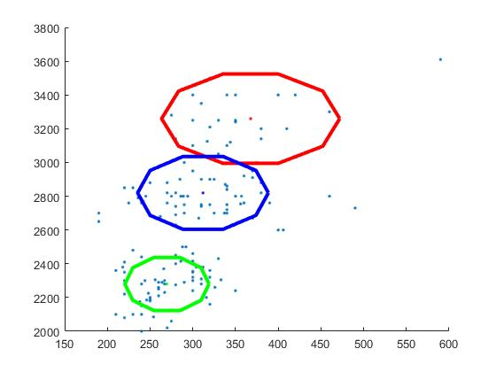
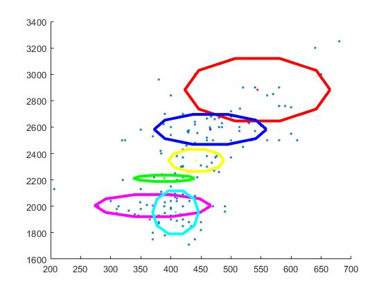

# Assignment 2: Clustering and MoG

---

## 2. MoG Modelling using the EM Algorithm
### Task 1:
``` matlab
%% task 1
load('PB_data.mat');
J = [f1,f2];

[n,~] = size(J);

figure(1);
plot(J(:,1),J(:,2),'.');
```
The result figures:


### Task 2:
In the *mog.m* file, adding the code below to generate a dataset **x** that contains only the F1 and F2.
``` matlab
%% task 2
[number,~] = size(phno);

count_phno1 = 1;
count_phno2 = 1;
for i = 1:number
    if phno(i) == 1
        x1(count_phno1,:) = [f1(i),f2(i)];
        count_phno1 =count_phno1 + 1;
    end
    
    if phno(i) == 2
        x2(count_phno2,:) = [f1(i),f2(i)];
        count_phno2 =count_phno2 + 1;
    end
end

x = x1;
```

After running the *mog.m* file, the results show below:

*1. When K = 3:*

The result graph:


The result MoG model:

 - *mu* is a 2*3 matrix, the value is:
 ``` matlab
 mu = [312.710439163323,	270.394427119210,	350.944427310065;
2784.44469003590e+03,	2285.45797383453e+03,	3229.23625856582e+03]
 ```
 - *p* is a 1*3 matrix, the value is:
 ``` matlab
 p = [0.382687297465680,	0.435128587673123,	0.182184114861197]
 ```
 - *s2* is a 2 * 2 * 3 matrix, the value is:
 ``` matlab
val(:,:,1) =

   1.0e+03 *

    3.5603         0
         0    7.7339


val(:,:,2) =

   1.0e+04 *

    0.1214         0
         0    1.4277


val(:,:,3) =

   1.0e+04 *

    0.4118         0
         0    2.7091


 ```


*2. When K = 6:*

The result graph:


The result MoG model:
- *mu* is a 2*6 matrix, the value is:
``` matlab
[333.301151546791,	309.171182344323,	314.443682651265,	284.247267200079,	244.957501372368,	458.465969387509;
3172.63228243276e+03,	2325.24372449017e+03,	2781.85307474120e+03,	2591.94227735183e+03,	2237.62777390853e+03,	3416.81380642650e+03]
```
- *p* is a 1*6 matrix, the value is:
``` matlab
[0.171249509264198,	0.150221313489049,	0.335031245076133,	0.0695248642416978,	0.248124309467916,	0.0258487584610062]
```
- *s2* is a 2 * 2 * 6 matrix, the value is:
``` matlab

val(:,:,1) =

   1.0e+04 *

    0.1242         0
         0    2.7331


val(:,:,2) =

   1.0e+03 *

    0.2779         0
         0    5.7640


val(:,:,3) =

   1.0e+03 *

    3.9580         0
         0    6.8954


val(:,:,4) =

   1.0e+04 *

    0.0024         0
         0    3.1738


val(:,:,5) =

   1.0e+04 *

    0.0366         0
         0    1.3749


val(:,:,6) =

   1.0e+04 *

    0.7479         0
         0    1.6615

```


*3. K = 6 for 2nd phoneme:*

The result graph:


The result MoG model:
- *mu* is a 2*6 matrix, the value is:
``` matlab
[544.064488976845,	389.075845110550,	465.645081333001,	442.297841772107,	370.132231710788,	407.965321650608;
2883.05491920153e+03,	2212.18739345475e+03,	2582.76483436577e+03,	2347.55469226313e+03,	2004.86418512093e+03,	1954.39100593128e+03]
```
- *p* is a 1*6 matrix, the value is:
``` matlab
[0.103584787611484,	0.0440218618511802,	0.307746216705428,	0.141480231793390,	0.149136837118164,	0.254030064920354]
```
- *s2* is a 2 * 2 * 6 matrix, the value is:
``` matlab

val(:,:,1) =

   1.0e+04 *

    0.7294         0
         0    3.0936


val(:,:,2) =

   1.0e+03 *

    1.2787         0
         0    0.3088


val(:,:,3) =

   1.0e+03 *

    4.3575         0
         0    7.1193


val(:,:,4) =

   1.0e+03 *

    1.0575         0
         0    3.8370


val(:,:,5) =

   1.0e+03 *

    4.6796         0
         0    3.8552


val(:,:,6) =

   1.0e+04 *

    0.0731         0
         0    1.4630


```

